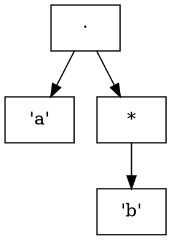

# Proyecto de Generador de Analizadores Léxicos a partir de especificaciones en YALex.

## Fases del proyecto y ubicación en la estructura

---

### Fase 0. Coordinación general

**Ubicación:** `src/main.rs`

### Qué hace

Es el punto de entrada del proyecto.

### Qué debería hacer

* leer argumentos de línea de comandos
* recibir la ruta del archivo `.yal`
* llamar las fases en orden
* manejar errores
* decidir dónde guardar resultados

### Entrada

* ruta del archivo `.yal`

### Salida

* coordinación del pipeline completo

---

### Fase 1. Leer y entender la especificación YALex

**Ubicación:** `src/spec/parser.rs`

### Qué hace

Lee el archivo `.yal` y separa sus partes.

### Qué debería hacer

* leer `header`
* leer definiciones `let`
* leer sección `rule`
* leer acciones asociadas
* capturar prioridad por orden
* guardar trailer o código auxiliar si existe

### Entrada

* texto completo del archivo `.yal`

### Salida

* una estructura interna tipo `SpecIR`

### Resultado esperado

El archivo ya no se ve como texto bruto, sino como datos organizados.

---

### Fase 2. Representar internamente la especificación

**Ubicación:** `src/spec/ast.rs`

### Qué hace

Define las estructuras de datos para guardar la especificación.

### Qué debería contener

* `SpecIR`
* `Definition`
* `Rule`
* prioridad de reglas
* acción asociada

### Entrada

* datos interpretados por el parser

### Salida

* representación interna limpia y usable por las siguientes fases


---

### Fase 3. Expandir definiciones y macros

**Ubicación:** `src/spec/expand.rs`

### Qué hace

Reemplaza referencias como `{DIGIT}` por su definición real.

### Qué debería hacer

* buscar definiciones declaradas con `let`
* sustituir referencias dentro de reglas
* detectar referencias faltantes
* detectar ciclos si una definición depende de otra indefinidamente

### Entrada

* `SpecIR`

### Salida

* reglas con regex ya expandidas

### Idea simple

Transforma expresiones abreviadas en expresiones completas.

---

### Fase 4. Convertir regex a árbol

**Ubicación:** `src/regex/parser.rs`

### Qué hace

Toma una expresión regular expandida y la convierte en una estructura de árbol.

### Qué debería hacer

* reconocer unión `|`
* reconocer concatenación
* reconocer `*`, `+`, `?`
* reconocer paréntesis
* reconocer clases de caracteres
* respetar precedencia

### Entrada

* regex expandida en texto

### Salida

* AST de regex

---

### Fase 5. Definir la estructura del AST de regex

**Ubicación:** `src/regex/ast.rs`

### Qué hace

Define los nodos que puede tener el árbol.

### Qué debería contener

* literal
* unión
* concatenación
* estrella
* plus
* opcional
* clase de caracteres
* vacío si se necesita

### Entrada

* no recibe datos directamente; define la forma del árbol

### Salida

* tipos y estructuras usadas por `regex/parser.rs`

### Idea simple

Es la plantilla de cómo se verá el árbol de expresiones regulares.

---

### Fase 6. Graficar el árbol

**Ubicación:** `src/graph/dot.rs`

### Qué hace

Convierte el AST a un formato graficable.

### Qué debería hacer

* recorrer el AST
* generar nodos y conexiones
* exportar un archivo `.dot`
* opcionalmente permitir luego generar `.png`

### Modelo de Entrada / Salida (contrato)

#### Entrada (datos en memoria)

* **AST de regex**: raíz del árbol (p.ej. `RegexNode`) ya parseado desde la regex expandida.
  * Ejemplo: `RegexNode::Concat(Box::new(RegexNode::Literal('a')), Box::new(RegexNode::Star(Box::new(RegexNode::Literal('b')))))`
* **Autómatas (opcional)**: representación del **AFN/NFA** y/o **AFD/DFA** cuando se quiera graficar una fase posterior.
  * Ejemplo (DFA): `start=0`, transición `(0, 'a', 1)`, estado de aceptación `{1 -> "ID"}`
* **Opciones de exportación (opcional)**:
  * tipo de grafo: `AST | NFA | DFA`
  * metadatos: título/label del grafo (“AST”, “DFA minimizado”, etc.)
  * normalización/escape de labels (comillas, saltos de línea, `ε`)
  * Ejemplo: `{ tipo: "DFA", label: "DFA minimizado", escape: true }`

#### Entrada (archivos)

* **No requerido**: esta fase no necesita leer archivos; consume estructuras construidas por fases anteriores.
  * Ejemplo: N/A (no se lee ningún archivo en esta fase)

#### Salida (archivos / artefactos)

* **Archivo `.dot`** (Graphviz DOT, texto)
  * destino sugerido: `output/ast.dot`, `output/nfa.dot`, `output/dfa.dot`
  * Ejemplo (ruta): `output/dfa.dot`
* **Render opcional (fuera de Rust)**: `.png/.svg` generado con Graphviz, por ejemplo `dot -Tpng input.dot -o output.png`
  * Ejemplo (comando): `dot -Tpng output/dfa.dot -o output/dfa.png`

#### Salida (datos en memoria)

* **Ninguna** (por diseño): es una fase de exportación/observabilidad.
  * Ejemplo: N/A (solo se produce el archivo `.dot`)

#### Reglas importantes

* **Determinismo de salida**: mismo input ⇒ mismo DOT (orden estable de nodos/aristas) para facilitar diffs.
* **Compatibilidad**: el DOT debe ser válido para Graphviz sin post-procesamiento.

**Archivo**: `src/graph/dot.rs`  
**Parte del lexer**: Exportación/visualización (Graphviz DOT)

#### Ejemplo visual (entrada → proceso → salida)

**Caso**: graficar el AST de la regex `ab*` (concatenación de `a` con `b*`).

**Entrada (formato real, dato en memoria)**: AST ya construido.

```text
RegexNode::Concat(
  Literal('a'),
  Star(Literal('b'))
)
```

**Qué pasa en el proceso**:

* Se recorre el árbol en profundidad, asignando IDs incrementales `n0, n1, n2, ...`.
* Por cada nodo se emite un nodo DOT con `label`.
* Por cada relación padre→hijo se emite una arista DOT.

**Salida (formato real, archivo)**: `output/ast.dot` (snippet).



---

### Fase 7. Construcción de AFN

**Ubicación:** `src/automata/nfa.rs`

### Qué hace

Convierte cada AST en un AFN usando Thompson.

### Qué debería hacer

* construir AFN para literal
* construir AFN para unión
* construir AFN para concatenación
* construir AFN para `*`, `+`, `?`
* marcar estados de aceptación por token
* manejar prioridad de reglas

### Entrada

* AST de cada regex

### Salida

* AFN por regla
* o AFN global si ya se combinan aquí


---

### Fase 8. Unir todos los AFN y convertir a AFD

**Ubicación:** `src/automata/subset.rs`

### Qué hace

Construye el AFD a partir del AFN usando el algoritmo de subconjuntos.

### Qué debería hacer

* calcular `epsilon-closure`
* calcular `move`
* construir estados del AFD
* definir estados de aceptación
* resolver prioridad si varios tokens coinciden

### Entrada

* AFN global

### Salida

* AFD


---

### Fase 9. Representar el AFD

**Ubicación:** `src/automata/dfa.rs`

### Qué hace

Guarda la estructura del AFD.

### Qué debería contener

* estados
* transiciones
* estado inicial
* estados de aceptación
* token aceptado por estado

### Entrada

* datos construidos por el algoritmo de subconjuntos

### Salida

* AFD bien estructurado


---

### Fase 10. Minimización del AFD

**Ubicación:** `src/automata/minimize.rs`

### Qué hace

Reduce el AFD sin cambiar el lenguaje reconocido.

### Qué debería hacer

* agrupar estados equivalentes
* producir un AFD más pequeño
* conservar aceptación y prioridad correctas

### Entrada

* AFD

### Salida

* AFD minimizado


---

### Fase 11. Construcción de tabla de transiciones

**Ubicación:** `src/table/transition_table.rs`

### Qué hace

Transforma el AFD en una tabla fácil de usar durante la simulación.

### Qué debería construir

* `delta[state][symbol]`
* `accept[state]`
* `start_state`

### Modelo de Entrada / Salida (contrato)

#### Entrada (datos en memoria)

* **AFD minimizado (`DFA`)**
  * estados, transiciones `(from, symbol, to)`, `start`
  * conjunto de aceptaciones y token por estado (y prioridad si aplica)
  * Ejemplo: `n_states=3`, `start=0`, `accept={2}`, `token_of[2]="NUM"`, transiciones `[(0,'0',2),(0,'1',2),(2,'0',2)]`
* **Dominio de símbolos**
  * alfabeto “efectivo” (símbolos presentes en transiciones) y/o el alfabeto objetivo (p.ej. ASCII 0..127)
  * Ejemplo: alfabeto efectivo `['0','1','2','3','4','5','6','7','8','9']` y tabla dimensionada a ASCII 128

#### Entrada (archivos)

* **No requerido**: se construye desde el DFA ya en memoria.
  * Ejemplo: N/A (no se lee ningún archivo en esta fase)

#### Salida (datos en memoria)

* **`TransitionTable`**
  * `delta[state][c] -> next_state | DEAD`
  * `accept[state] -> Option<token>`
  * `start_state`
  * (opcional) `alphabet` para debug/impresión
  * Ejemplo:
    * `start_state=0`
    * `accept[2]=Some("NUM")`
    * `delta[0]['7']=2`, `delta[0]['a']=DEAD`

#### Salida (archivos / artefactos) (opcional)

* **Dump de depuración**: tabla impresa o exportada a `output/transition_table.txt`/`.csv`
  * Ejemplo (ruta): `output/transition_table.csv`

#### Reglas importantes

* **Estado muerto (`DEAD`)**: valor centinela único y consistente.
* **Carácteres fuera de dominio**: documentar qué pasa si \(c\) no está representado (p.ej. tratarlo como `DEAD`).

**Archivo**: `src/table/transition_table.rs`  
**Parte del lexer**: Construcción de la tabla de transición (\(\delta\))

#### Ejemplo visual (entrada → proceso → salida)

**Caso**: token `NUM` para regex `[0-9]+` con tabla ASCII-128.

**Entrada (formato real, dato en memoria)**: DFA minimizado (vista “humana” de transiciones relevantes).

```text
Estados: 0 (inicio), 1 (aceptación: NUM)
Transiciones:
  0 --'0'..'9'--> 1
  1 --'0'..'9'--> 1
Aceptación:
  token_of[1] = "NUM"
```

**Qué pasa en el proceso**:

* Se crea `delta[n_states][128]` inicializada a `DEAD`.
* Se cargan transiciones: `delta[from][sym] = to`.
* Se genera `accept[state] = Some(token)` para estados de aceptación.

**Salida (formato real, dato en memoria)**: `TransitionTable` (fragmento).

```text
start_state = 0
accept[0] = None
accept[1] = Some("NUM")

delta[0]['5'] = 1
delta[0]['a'] = DEAD
delta[1]['0'] = 1
delta[1]['9'] = 1
```

**Salida (visual opcional, archivo)**: `output/transition_table.csv` (snippet).

```csv
state,'0','1','2','3','4','5','6','7','8','9',accept
0,1,1,1,1,1,1,1,1,1,1,
1,1,1,1,1,1,1,1,1,1,1,NUM
```

### Idea simple

En vez de recorrer estructuras complejas, el lexer luego solo consulta la tabla.

---

### Fase 12. Simulación del analizador léxico

**Ubicación:** `src/runtime/simulator.rs`

### Qué hace

Usa la tabla para analizar texto real.

### Qué debería hacer

* leer la entrada carácter por carácter
* moverse por la tabla
* recordar la última aceptación válida
* aplicar maximal munch
* romper empate por prioridad de regla
* emitir tokens
* reportar error cuando no haya coincidencia

### Modelo de Entrada / Salida (contrato)

#### Entrada (datos en memoria)

* **`TransitionTable`**: `start_state`, `delta`, `accept` (y opcionalmente `alphabet`)
  * Ejemplo: `start_state=0`, `accept[5]=Some("ID")`
* **Política de matching**
  * **maximal munch**: prefijo más largo aceptado
  * **desempate por prioridad**: si hay empate, gana la regla/token de mayor prioridad (normalmente: primera regla declarada)
  * Ejemplo: con entrada `"=="`, si hay reglas `"="` y `"=="`, se retorna token `"EQEQ"` por maximal munch

#### Entrada (archivos / fuentes)

* **Texto a analizar**
  * puede venir como `&str` (ya leído por CLI) o desde un archivo fuente si el runtime lo implementa así
  * Ejemplo (archivo): `tests/inputs/ejemplo.txt`
  * Ejemplo (contenido): `"var x = 123;"`

#### Salida (datos en memoria)

* **Tokens**: `Vec<Token>` (o stream `Token/Error/EOF`)
* **Errores léxicos**: `Vec<String>` (o stream de errores)
  * Ejemplo (token): `Token { kind: "NUM", lexeme: "123", line: 1, col: 9 }`
  * Ejemplo (error): `"Error línea 3:17 — carácter '@'"`

#### Salida (archivos / artefactos) (opcional)

* **Log**: `output/tokens.txt` y/o `output/errors.txt` si se decide persistir.
  * Ejemplo (ruta): `output/tokens.txt`

#### Reglas importantes

* **Tracking de posición**: actualización correcta de `line/col` (manejo de `\n`).
* **Tokens “skip”**: documentar si whitespace/comentarios se emiten o se omiten.
* **EOF**: comportamiento explícito (evento `EOF` o fin del stream).

**Archivo**: `src/runtime/simulator.rs`  
**Parte del lexer**: Simulación/ejecución del lexer (maximal munch)

#### Ejemplo visual (entrada → proceso → salida)

**Caso**: analizar `var x = 123;` suponiendo tokens `ID`, `NUM`, `EQ`, `SEMI` y que whitespace se omite.

**Entrada (formato real, archivo)**: `tests/inputs/ejemplo.txt`

```text
var x = 123;
```

**Qué pasa en el proceso** (resumen):

* Se avanza por la tabla (`delta`) carácter por carácter.
* Se recuerda la **última aceptación** (posición+token) mientras se avanza.
* Al caer a `DEAD`, se aplica **maximal munch**: se retrocede a la última aceptación y se emite el token.
* Se repite hasta `EOF`.

**Salida (formato real, dato en memoria)**: tokens emitidos (visual).

```text
Token(kind="ID",   lexeme="var", line=1, col=1)
Token(kind="ID",   lexeme="x",   line=1, col=5)
Token(kind="EQ",   lexeme="=",   line=1, col=7)
Token(kind="NUM",  lexeme="123", line=1, col=9)
Token(kind="SEMI", lexeme=";",   line=1, col=12)
EOF
```

**Salida (visual opcional, archivo)**: `output/tokens.txt` (snippet).

```text
1:1   ID   "var"
1:5   ID   "x"
1:7   EQ   "="
1:9   NUM  "123"
1:12  SEMI ";"
```


---

### Fase 13. Generación de código del lexer

**Ubicación:** `src/codegen/rust_codegen.rs`

### Qué hace

Genera el archivo fuente final del analizador léxico.

### Qué debería hacer

* escribir estructuras necesarias
* escribir la tabla de transición
* escribir la lógica de `next_token`
* insertar acciones de usuario
* guardar el archivo generado, por ejemplo `generated/lexer.rs`

### Modelo de Entrada / Salida (contrato)

#### Entrada (datos en memoria)

* **`TransitionTable`** (de `table/transition_table.rs`)
  * `delta` serializable a `static`/`const`
  * `accept` serializable (tokens por estado)
  * `start_state`
  * Ejemplo: `static DELTA: [[i32; 128]; N] = [...]` y `static ACCEPT: [Option<&'static str>; N] = [...]`
* **Reglas expandidas**
  * lista ordenada de reglas con `token_name` y `priority`
  * acciones asociadas (si el diseño las integra en el lexer generado)
  * Ejemplo: `[ { token_name: "ID", priority: 0 }, { token_name: "NUM", priority: 1 } ]`
* **Código auxiliar (si existe en el `.yal`)**
  * `header`/`trailer` (imports, helpers, definiciones del usuario)
  * Ejemplo (header): `use std::fmt;`
* **Opciones de generación (opcional)**
  * nombre/ruta del archivo de salida
  * estrategia de dominio de símbolos (ASCII fijo vs mapeo/compresión)
  * Ejemplo: `{ out: "generated/lexer.rs", domain: "ASCII-128" }`

#### Entrada (archivos)

* **No requerido directo**: este módulo típicamente recibe estructuras ya construidas; no necesita releer el `.yal`.
  * Ejemplo: N/A (la lectura del `.yal` ocurre en fases anteriores)

#### Salida (archivos / artefactos)

* **Archivo Rust generado**: p.ej. `generated/lexer.rs`
  * Ejemplo (ruta): `generated/lexer.rs`
* (opcional) **archivos auxiliares**:
  * `generated/tokens.rs` (enum o tipos de token)
  * `generated/actions.rs` (dispatch de acciones)
  * Ejemplo (ruta): `generated/tokens.rs`

#### Salida (datos en memoria)

* **Ninguna** (por diseño): la finalidad es persistir código fuente.
  * Ejemplo: N/A (se escribe archivo, no se retorna estructura)

#### Reglas importantes

* **Reproducibilidad**: mismo input ⇒ misma salida (orden estable y formato estable).
* **Separación data/lógica**: tabla como “data-only”; runtime mínimo (loop de `next_token`, maximal munch, etc.).
* **Acciones**: documentar claramente si se generan como `match kind { ... }` o si solo se retorna `(kind, lexeme)`.

**Archivo**: `src/codegen/rust_codegen.rs`  
**Parte del lexer**: Generación de código (emitir `generated/lexer.rs`)

#### Ejemplo visual (entrada → proceso → salida)

**Caso**: generar `generated/lexer.rs` con una tabla pequeña para `NUM = [0-9]+`.

**Entrada (formato real, dato en memoria)**: `TransitionTable` (resumen de lo que se serializa).

```text
n_states = 2
start_state = 0
accept[0] = None
accept[1] = Some("NUM")
delta[0]['0'..'9'] = 1
delta[1]['0'..'9'] = 1
resto = DEAD
```

**Qué pasa en el proceso**:

* Se “imprime” la tabla como arreglos Rust `static`/`const` (`DELTA`, `ACCEPT`).
* Se genera la función `next_token(...)` que implementa maximal munch sobre `DELTA/ACCEPT`.
* Se escribe el archivo final a disco.

**Salida (formato real, archivo)**: `generated/lexer.rs` (snippet).

```rust
// Generado automáticamente — NO editar
const DEAD: i32 = -1;
const START: usize = 0;

static ACCEPT: [Option<&'static str>; 2] = [
    None,
    Some("NUM"),
];

static DELTA: [[i32; 128]; 2] = [
    /* state 0 */ [/* ... 128 ints ... */],
    /* state 1 */ [/* ... 128 ints ... */],
];

#[derive(Debug, Clone)]
pub struct Token {
    pub kind: &'static str,
    pub lexeme: String,
    pub line: usize,
    pub col: usize,
}
```


---

### Fase 14. Manejo de errores

**Ubicación:** `src/error.rs`

### Qué hace

Centraliza errores del proyecto.

### Qué debería manejar

* formato inválido del `.yal`
* definición inexistente
* regex mal formada
* transición inválida
* error de generación de archivo


---

## 5. Flujo completo del proyecto

```text
archivo .yal
   ↓
spec/parser.rs
   ↓
spec/ast.rs
   ↓
spec/expand.rs
   ↓
regex/parser.rs + regex/ast.rs
   ↓
graph/dot.rs
   ↓
automata/nfa.rs
   ↓
automata/subset.rs + automata/dfa.rs
   ↓
automata/minimize.rs
   ↓
table/transition_table.rs
   ↓
runtime/simulator.rs
   ↓
codegen/rust_codegen.rs
   ↓
lexer generado
   ↓
texto de entrada
   ↓
tokens / errores léxicos
```
---
